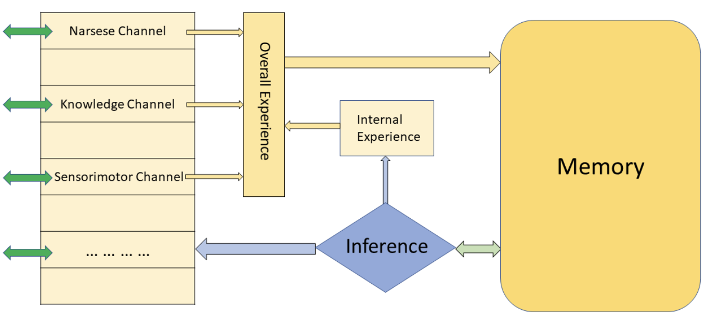

OpenNARS is the open-source implementation of NARS. The reasoner "core" of OpenNARS is under the MIT license. OpenNARS 4 is a new version of OpenNARS with some new features, implemented in Python. 

# Foundations

A recent overview of NARS can be found [here](https://proceedings.mlr.press/v192/wang22a/wang22a.pdf). This [introduction](https://cis.temple.edu/~pwang/NARS-Intro.html) of NARS is also recommended.

## *Narsese* as a Formal Language

NARS is a reasoning system, while its knowledge representation is called *Narsese* [^1], which defines the grammar and sentences acceptable by the system. 

To interact with NARS, human users should express sentences in *Narsese*.
OpenNARS 4 inherits the same grammar from previous versions. For details, please refer to:

 - [Narsese Grammar (Input Output Format)](https://github.com/opennars/opennars/wiki/Narsese-Grammar-(Input-Output-Format)), and 
 - [Narsese symbol list (ASCII version)](https://github.com/opennars/opennars/wiki/Narsese-symbol-list-(ASCII-version))
 - [Non-axiomatic logic: A model of intelligent reasoning](https://www.worldscientific.com/worldscibooks/10.1142/8665#t=aboutBook) (book)

## NAL as a Logic of Intelligence

*Non-Axiomatic Logic* (NAL) is a logic of intelligence in the sense that it “provides a unified explanation for many cognitive functions of the human mind, and is also concrete enough to guide the actual building of a general purpose ‘thinking machine’.” [^2] For details, please refer to
 - [Non Axiomatic Logic (NAL) Overview](https://github.com/opennars/opennars/wiki/Non-Axiomatic-Logic-(NAL),-the-logic-behind-OpenNARS)
 - [The Logic of Intelligence](https://link.springer.com/chapter/10.1007/978-3-540-68677-4_2) (book chapter)
 - [Non-axiomatic logic: A model of intelligent reasoning](https://www.worldscientific.com/worldscibooks/10.1142/8665#t=aboutBook) (book)

## NARS

Based on the formal language (*Narsese*) and the logic theory (NAL), an the topmost level, the newest architecture of NARS involves *memory*, *inference engine*, *channels* as the interface with the environment, and *control mechanism* that organize inference steps together and modifies the inner states of *memroy* and *channels*.

The memory of NARS can be viewed as a network of concepts, also called as conceptual network. It is implemented based on some data-structures.
OpenNARS 4 adopts the same [memory](https://github.com/opennars/opennars/wiki/Memory-Overview) design and basic data-structures (including [`Concept`](https://github.com/opennars/opennars/wiki/Concept-Object:-Content-and-Attributes), [`Task` and `Belief`](https://github.com/opennars/opennars/wiki/Task-and-Belief), [`TaskLink` and `TermLink`](https://github.com/opennars/opennars/wiki/TaskLink-and-TermLink), *etc*.) with version 3. 


However, OpenNARS 4 adopts different ways to implement the inference engine, and some new features (see [here](#New-Features)) are added to the control mechanism.

For the moment, there are two alernatives of inference engin in OpenNARS 4 -- a declarative approach to implement the [inference engine](https://drive.google.com/file/d/1uIjRqeCAU-IRKGo_tNJN8F8ghHI8q1qD/view) (though not fully implemented), and the other that is similar to OpenNARS 3.

# New Features in OpenNARS 4

 - **Architecture**: The new architecture contains a memory, an inference engince (both of which are remains the same with the old version), an *internal experience buffer*, and an *overall experience buffer*. There are ***multiple channels*** as the interface between the system and the environment. For the momement, the following channels have been implemented or are under consideration:
   - **Multiple Channels**
     - **Consle-Channel**: An interface for admins to check the outputs and states of the system.
     - **User-Channel**: An interface of common users to interact with the system using *Narsese*.
     - **Knowledge-Base-Channels** (not implemented yet): An interface to knowledge bases, *e.g.*, *ConceptNet*, other Knowledge Graphs, LLMs, *etc*.
     - **Sensorimotor-Channel** (not implemented yet): This channel is specialzed for the sensorimotor procedures. For example, it helps the system to play the pong game.
   - **Buffers**
     - **internal experience buffer**: It organizes the system's internal experience of its thinking activity.
     - **overall experience buffer**: It organizes both internal experience (from the internal experience buffer) and external experience (from channels, which organize the experence from the outer environment).
     - A critical role of the two buffers is learning temporal relations among events (not fully implemented yet).
   - The new architecture was mentioned in the old versions' technical reports, but was not been implemented succesfully.
 - **Global Evaluators:** The four global evaluators mentioned in the [old technical report](https://cis.temple.edu/tagit/publications/PAGI-TR-11.pdf) are implemented in this version. 
    - *satisfaction*: the extent to which the current situation meet the system’s desires,
    - *alertness*: the extent to which the system’s knowledge is insufficient,
    - *busyness*: the extent to which the system’s time resource is insufficient,
    - *well-being*: the extent to which the system’s “body” functions as expected.
 - **[Declarative Inference Engine](https://drive.google.com/file/d/1uIjRqeCAU-IRKGo_tNJN8F8ghHI8q1qD/view)** (in progress)



Fig. 1. The current architecture of NARS [^3]


# Technical Report

The OpenNARS 4 Technical Report is in progress. 
<!-- Hopefully, it will be published in the near future. -->

# Links

 - [OpenNARS 3 for Research](https://github.com/opennars/opennars)
 - [OpenNARS for Application](https://github.com/opennars/OpenNARS-for-Applications)
 - [Temple AGI Team](https://cis.temple.edu/tagit/)

---

# References

[^1]: Wang, Pei. [Non-axiomatic logic: A model of intelligent reasoning](https://www.worldscientific.com/worldscibooks/10.1142/8665#t=aboutBook). World Scientific, 2013.
[^2]: Wang, Pei. "[The logic of intelligence](https://link.springer.com/chapter/10.1007/978-3-540-68677-4_2)." Artificial general intelligence. Berlin, Heidelberg: Springer Berlin Heidelberg, 2007. 31-62.
[^3]: Wang, Pei, et al. [The conceptual design of openNARS 3.1](https://cis.temple.edu/tagit/publications/PAGI-TR-11.pdf). Technical report, Temple University, Philadelphia, United States, 2020.
<!-- 
Text can be **bold**, _italic_, or ~~strikethrough~~.

[Link to another page](./another-page.html).

There should be whitespace between paragraphs.

There should be whitespace between paragraphs. We recommend including a README, or a file with information about your project.

# Header 1

This is a normal paragraph following a header. GitHub is a code hosting platform for version control and collaboration. It lets you and others work together on projects from anywhere.

## Header 2

> This is a blockquote following a header.
>
> When something is important enough, you do it even if the odds are not in your favor.

### Header 3

```js
// Javascript code with syntax highlighting.
var fun = function lang(l) {
  dateformat.i18n = require('./lang/' + l)
  return true;
}
```

```ruby
# Ruby code with syntax highlighting
GitHubPages::Dependencies.gems.each do |gem, version|
  s.add_dependency(gem, "= #{version}")
end
```

#### Header 4

*   This is an unordered list following a header.
*   This is an unordered list following a header.
*   This is an unordered list following a header.

##### Header 5

1.  This is an ordered list following a header.
2.  This is an ordered list following a header.
3.  This is an ordered list following a header.

###### Header 6

| head1        | head two          | three |
|:-------------|:------------------|:------|
| ok           | good swedish fish | nice  |
| out of stock | good and plenty   | nice  |
| ok           | good `oreos`      | hmm   |
| ok           | good `zoute` drop | yumm  |

### There's a horizontal rule below this.

* * *

### Here is an unordered list:

*   Item foo
*   Item bar
*   Item baz
*   Item zip

### And an ordered list:

1.  Item one
1.  Item two
1.  Item three
1.  Item four

### And a nested list:

- level 1 item
  - level 2 item
  - level 2 item
    - level 3 item
    - level 3 item
- level 1 item
  - level 2 item
  - level 2 item
  - level 2 item
- level 1 item
  - level 2 item
  - level 2 item
- level 1 item

### Small image


### Large image


### Definition lists can be used with HTML syntax.

<dl>
<dt>Name</dt>
<dd>Godzilla</dd>
<dt>Born</dt>
<dd>1952</dd>
<dt>Birthplace</dt>
<dd>Japan</dd>
<dt>Color</dt>
<dd>Green</dd>
</dl>

```
Long, single-line code blocks should not wrap. They should horizontally scroll if they are too long. This line should be long enough to demonstrate this.
```

```
The final element.
``` -->